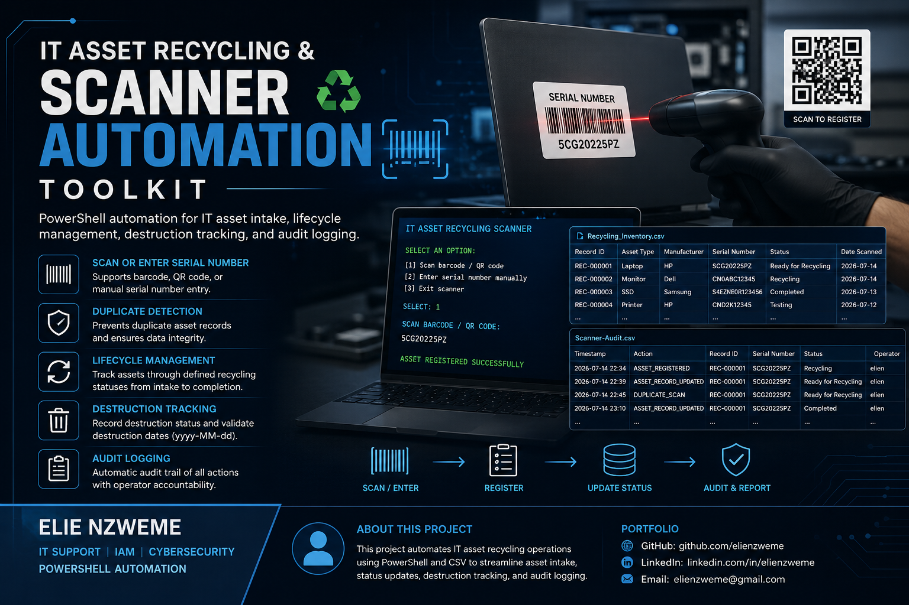

# IT-Asset-Recycling-and-Scanner-Automation-Toolkit


## PowerShell-based IT asset recycling and lifecycle automation toolkit supporting barcode/QR scanning, manual serial number entry, duplicate detection, status tracking, destruction documentation, and automated audit logging.

---

<p align="center">
  
</p>

<p align="center">
  <strong>IT Asset Recycling & Scanner Automation Toolkit</strong><br>
  PowerShell Automation | IT Asset Lifecycle | ITAM | Audit Logging
</p>

<p align="center">
  <a href="docs/IT-Asset-Recycling-and-Scanner-Automation-Toolkit-Documentation.pdf">
    <strong>📄 View Full Project Documentation (PDF)</strong>
  </a>
</p>

---

# IT Asset Recycling and Scanner Automation Toolkit

The project uses a barcode/QR scanner or manual serial number entry to register IT equipment into a centralized CSV inventory. A separate PowerShell workflow is used to update existing assets as they move through the recycling lifecycle.

---

## Project Overview

IT recycling teams may process laptops, desktops, monitors, printers, hard drives, SSDs, servers, mobile devices, and other equipment.

Manually entering every asset into a spreadsheet can be repetitive and may introduce duplicate records or inconsistent data.

This project creates a guided PowerShell workflow for IT asset recycling operations.

The toolkit can:

- Scan a barcode or QR code containing a serial number.
- Manually enter a serial number when an asset has no readable barcode or QR code.
- Detect duplicate serial numbers before adding an asset.
- Generate sequential recycling Record IDs.
- Standardize asset type selection.
- Provide a predefined manufacturer list with an `Other` option.
- Track recycling lifecycle status.
- Record whether an asset was destroyed.
- Validate destruction dates using `yyyy-MM-dd`.
- Maintain a current-state recycling inventory.
- Automatically generate a separate audit log.
- Prevent identical audit events from being stored repeatedly.
- Record the Windows operator associated with audit events.

---

## Technologies Used

| Technology | Purpose |
|---|---|
| PowerShell | Scanner workflow, menu logic, validation, CSV processing, and automation |
| CSV | Lightweight inventory and audit data storage |
| Barcode / QR Scanner | Keyboard-emulation serial number input |
| Microsoft Excel | Optional review and analysis of CSV data |
| Git / GitHub | Source control and project documentation |

The automation scripts are written in **PowerShell** and use the `.ps1` file extension.

---

## Project Structure

```text
IT-Asset-Recycling-and-Scanner-Automation-Toolkit/
│
├── data/
│   └── Recycling_Inventory.csv
│
├── scripts/
│   ├── Start-RecyclingScanner.ps1
│   └── Update-RecyclingStatus.ps1
│
├── logs/
│   └── Scanner-Audit.csv
│
├── docs/
│   └── Project documentation and workflow notes
│
└── README.md
```

### Folder Responsibilities

| Location | File / Folder | Purpose |
|---|---|---|
| `data/` | `Recycling_Inventory.csv` | Master inventory and current asset state |
| `scripts/` | `Start-RecyclingScanner.ps1` | Registers new recycling assets |
| `scripts/` | `Update-RecyclingStatus.ps1` | Updates existing asset lifecycle and destruction data |
| `logs/` | `Scanner-Audit.csv` | Historical event and audit trail |
| `docs/` | Documentation | Technical notes, workflow, screenshots, and procedures |
| Project root | `README.md` | GitHub project overview and instructions |

---

## Master Recycling Inventory

The primary data file is:

```text
data/Recycling_Inventory.csv
```

The CSV contains the following fields:

```text
Record ID
Asset Type
Manufacturer
Serial Number
Status
Date Scanned
Was Asset Destroyed
Date Destroyed
```

### Field Definitions

| Field | Description |
|---|---|
| Record ID | Automatically generated recycling tracking ID |
| Asset Type | Type of IT equipment |
| Manufacturer | Asset manufacturer |
| Serial Number | Scanned or manually entered serial number |
| Status | Current recycling lifecycle status |
| Date Scanned | Date the asset was registered |
| Was Asset Destroyed | `Yes` or `No` destruction indicator |
| Date Destroyed | Manually entered destruction date when applicable |

Example record:

```text
Record ID:             REC-000001
Asset Type:            Laptop
Manufacturer:          HP
Serial Number:         5CG20225PZ
Status:                Recycling
Date Scanned:          2026-07-14
Was Asset Destroyed:   No
Date Destroyed:
```

The date format used by the project is:

```text
yyyy-MM-dd
```

Example:

```text
2026-07-14
```

---

## Recycling Lifecycle Statuses

The toolkit uses the following status values:

| Status | Description |
|---|---|
| Received | Asset has entered the recycling intake process |
| Testing | Asset is being inspected or tested |
| Data Wipe Pending | Data-bearing equipment requires sanitization |
| Ready for Recycling | Processing is complete and the asset is ready for recycling |
| Recycling | Asset is currently in the recycling process |
| Refurbish | Asset may be repaired or reused |
| Parts | Asset is retained or dismantled for parts |
| Completed | Recycling or destruction workflow is complete |

---

## Scanner and Manual Serial Number Input

Run:

```powershell
.\scripts\Start-RecyclingScanner.ps1
```

The script displays:

```text
SERIAL NUMBER INPUT
------------------------------------------------
[1] Scan barcode / QR code
[2] Enter serial number manually
[3] Exit scanner

SELECT:
```

### Option 1 - Scan Barcode or QR Code

Select:

```text
1
```

The script prompts:

```text
SCAN BARCODE / QR CODE:
```

Scan the device label.

If the barcode or QR code contains:

```text
5CG20225PZ
```

the value is treated as the asset Serial Number.

### Option 2 - Manually Enter a Serial Number

Select:

```text
2
```

The script prompts:

```text
ENTER SERIAL NUMBER:
```

Example:

```text
ENTER SERIAL NUMBER: CN0ABC12345
```

This option is useful for assets that have a printed serial number but no readable barcode or QR code.

### Option 3 - Exit

Select:

```text
3
```

The scanner workflow closes.

> Both scanned and manually entered serial numbers use the same duplicate detection and registration workflow.

---

## New Asset Registration Workflow

```text
PHYSICAL IT ASSET
        |
        v
Start-RecyclingScanner.ps1
        |
        v
SERIAL NUMBER INPUT
        |
        +---- [1] Scan Barcode / QR Code
        |
        +---- [2] Enter Serial Number Manually
        |
        +---- [3] Exit Scanner
        |
        v
Capture Serial Number
        |
        v
Check Recycling_Inventory.csv
        |
        v
Serial Number Already Exists?
       / \
     YES  NO
      |    |
      |    +--------> Select Asset Type
      |                     |
      |                     v
      |              Select Manufacturer
      |                     |
      |                     v
      |                Select Status
      |                     |
      |                     v
      |              Generate REC-######
      |                     |
      |                     v
      |                Set Date Scanned
      |                     |
      |                     v
      |              Add Inventory Record
      |                     |
      |                     v
      |              Audit ASSET_REGISTERED
      |
      v
DUPLICATE DEVICE DETECTED
      |
      v
Device Not Added
      |
      v
Audit DUPLICATE_SCAN
```

---

## Duplicate Asset Detection

Before registering a new asset, the scanner script checks the `Serial Number` field in:

```text
Recycling_Inventory.csv
```

If the serial number already exists, the script displays:

```text
!!!!!!!!!!!!!!!!!!!!!!!!!!!!!!!!!!!!!!!!!!!!!!
 DUPLICATE DEVICE DETECTED
!!!!!!!!!!!!!!!!!!!!!!!!!!!!!!!!!!!!!!!!!!!!!!

Serial Number: 5CG20225PZ
Record ID:     REC-000001
Device:        HP Laptop
Status:        Ready for Recycling

DEVICE NOT ADDED.
```

The asset is **not added to the master inventory again**.

The project uses:

```text
Serial Number
```

as the primary duplicate-control value.

`Record ID` is the internally generated recycling tracking identifier.

---

## Automatic Record ID Generation

The scanner automatically generates sequential recycling Record IDs.

Example:

```text
REC-000001
REC-000002
REC-000003
REC-000004
```

The operator does not manually create the Record ID.

The script reviews existing inventory records, identifies the highest valid `REC-######` value, and generates the next ID.

---

## Manufacturer Selection

The scanner provides a guided manufacturer menu.

Example manufacturers include:

```text
Dell
HP
Lenovo
Apple
Microsoft
Acer
ASUS
Samsung
LG
ViewSonic
Epson
Canon
Brother
Lexmark
Xerox
Seagate
Western Digital
Kingston
SanDisk
Toshiba
Cisco
Ubiquiti
Netgear
Other
```

If the manufacturer is not listed, select:

```text
Other
```

The script then allows manual manufacturer entry.

---

## Updating an Existing Asset

Use:

```powershell
.\scripts\Update-RecyclingStatus.ps1
```

The script asks for:

```text
Scan or enter Serial Number / Record ID:
```

The operator can use a Serial Number:

```text
5CG20225PZ
```

or a Record ID:

```text
REC-000001
```

The script locates the existing inventory record and displays its current state.

Example:

```text
Record ID:             REC-000001
Device:                HP Laptop
Serial Number:         5CG20225PZ
Current Status:        Recycling
Was Asset Destroyed:   No
Date Destroyed:
```

The operator selects a new lifecycle status.

The script then asks:

```text
Was this asset destroyed? [Y/N]
```

If the answer is:

```text
Y
```

the script requests:

```text
Date Destroyed [yyyy-MM-dd]:
```

Example:

```text
2026-07-10
```

The date is validated before it is saved.

---

## Existing Asset Update Workflow

```text
EXISTING ASSET
        |
        v
Update-RecyclingStatus.ps1
        |
        v
Scan / Enter Serial Number
or Enter Record ID
        |
        v
Locate Existing Record
        |
        v
Display Current Asset State
        |
        v
Select New Status
        |
        v
Was Asset Destroyed?
       / \
      N   Y
      |   |
      |   v
      |  Enter Date Destroyed
      |   yyyy-MM-dd
      |       |
      |       v
      |  Validate Date
      |
      v
Update Same Inventory Record
        |
        v
Save Recycling_Inventory.csv
        |
        v
Write ASSET_RECORD_UPDATED
        |
        v
RECORD UPDATED
```

The update script changes the **existing asset record**.

It does not create another asset inventory row.

---

## Audit Logging

The audit log is stored at:

```text
logs/Scanner-Audit.csv
```

The scripts automatically generate the audit CSV when it does not exist.

The audit log contains:

```text
Timestamp
Action
Record ID
Asset Type
Manufacturer
Serial Number
Status
Was Asset Destroyed
Date Destroyed
Operator
```

### Audit Actions

Examples include:

```text
ASSET_REGISTERED
ASSET_RECORD_UPDATED
DUPLICATE_SCAN
```

### Example Audit History

```text
ASSET_REGISTERED
Status: Recycling

        |
        v

ASSET_RECORD_UPDATED
Status: Ready for Recycling

        |
        v

ASSET_RECORD_UPDATED
Status: Completed
```

A lifecycle update is intentionally stored as a separate audit event.

This preserves historical activity.

---

## Current State vs Historical Audit

The two CSV files have different responsibilities.

### Recycling_Inventory.csv

Answers:

> What is the current state of the asset?

Example:

```text
REC-000001
Status: Ready for Recycling
```

### Scanner-Audit.csv

Answers:

> What happened to the asset over time?

Example:

```text
ASSET_REGISTERED       -> Recycling
ASSET_RECORD_UPDATED   -> Ready for Recycling
ASSET_RECORD_UPDATED   -> Completed
```

The main inventory is the **current-state source of truth**.

The audit log is the **historical activity trail**.

---

## Duplicate Audit Event Prevention

The updated audit workflow checks whether an identical event already exists.

The script compares:

```text
Action
Record ID
Serial Number
Status
Was Asset Destroyed
Date Destroyed
```

If the same audit event already exists, it is not appended again.

Example:

```text
DUPLICATE_SCAN
REC-000001
5CG20225PZ
Ready for Recycling
No
```

If the exact event already exists:

```text
AUDIT EVENT ALREADY EXISTS - NOT ADDED AGAIN.
```

A real lifecycle update is still stored as a new event because the status or destruction information changed.

---

## CSV File Lock Handling

Microsoft Excel may lock a CSV while it is open.

PowerShell may display an error similar to:

```text
The process cannot access the file
'...\Recycling_Inventory.csv'
because it is being used by another process.
```

Recommended workflow:

```text
Close Recycling_Inventory.csv in Excel
        |
        v
Run PowerShell Script
        |
        v
PowerShell Updates CSV
        |
        v
Finish Write Operation
        |
        v
Open CSV in Excel for Review
```

Close the inventory CSV before running a script that needs to rewrite it.

---

## Running the Project

Open PowerShell and navigate to the project directory.

```powershell
cd C:\Projects\IT-Asset-Recycling-and-Scanner-Automation-Toolkit
```

If local script execution is blocked in a lab or authorized test environment, the project was tested using a temporary process-scoped execution-policy setting:

```powershell
Set-ExecutionPolicy -Scope Process Bypass
```

This applies to the current PowerShell process only.

Closing the PowerShell window ends the process-scoped setting.

> In a corporate environment, follow the organization's approved PowerShell execution, application control, and security policies.

### Start New Asset Intake

```powershell
.\scripts\Start-RecyclingScanner.ps1
```

### Update an Existing Asset

```powershell
.\scripts\Update-RecyclingStatus.ps1
```

---

## Permissions

The normal CSV import/export and PowerShell workflow do not inherently require local administrator privileges.

The operator needs appropriate permissions to:

- Read the PowerShell scripts.
- Read `Recycling_Inventory.csv`.
- Modify `Recycling_Inventory.csv`.
- Create or modify `Scanner-Audit.csv`.

In an enterprise environment, PowerShell execution may be controlled through:

- Group Policy.
- AppLocker.
- Windows Defender Application Control.
- Endpoint security tools.
- Execution policy.
- File and folder permissions.

The toolkit should be reviewed and deployed according to organizational security policy.

---

## Operational Use Cases

This project can support workflows involving:

- IT asset recycling.
- IT asset disposition.
- Electronics recycling.
- Hardware retirement.
- End-of-life equipment processing.
- Data-bearing device identification.
- Recycling intake operations.
- Asset lifecycle tracking.
- Destruction documentation.
- IT inventory reconciliation.

---

## Skills Demonstrated

This project demonstrates experience with:

- PowerShell scripting.
- PowerShell interactive menu design.
- IT asset lifecycle management.
- IT asset recycling workflows.
- Barcode and QR scanner integration.
- Manual input handling.
- CSV data processing.
- `Import-Csv`.
- `Export-Csv`.
- PowerShell custom objects.
- Duplicate detection.
- Sequential identifier generation.
- Input validation.
- Date validation.
- Audit logging.
- Duplicate audit-event prevention.
- Current-state data management.
- Historical event tracking.
- File-lock handling.
- Operational process documentation.

---

## Project Design Decisions

### Why PowerShell?

PowerShell is commonly used for Windows administration and IT operations automation.

It provides built-in support for object manipulation, CSV processing, interactive input, and Windows environment information.

### Why CSV?

CSV provides a lightweight data format that can be:

- Processed directly with PowerShell.
- Reviewed in Microsoft Excel.
- Imported into reporting tools.
- Migrated to a database later.

### Why Separate Inventory and Audit Files?

The inventory and audit files serve different purposes.

```text
Recycling_Inventory.csv
        |
        +---- Current Asset State

Scanner-Audit.csv
        |
        +---- Historical Asset Events
```

Keeping them separate prevents historical events from cluttering the current inventory while preserving operational traceability.

### Why Use Serial Number for Duplicate Detection?

A generated Record ID identifies the recycling record.

The Serial Number identifies the physical asset in the current project design.

Checking serial numbers before registration reduces accidental duplicate inventory records.

---

## Future Improvements

Potential future enhancements include:

- SQLite or SQL Server database integration.
- PowerShell GUI.
- Web-based asset intake interface.
- Role-based access controls.
- Active Directory or Entra ID operator identity integration.
- Power BI recycling dashboard.
- Automated recycling metrics.
- Data sanitization status tracking.
- Chain-of-custody tracking.
- Exportable recycling reports.
- Certificate of destruction tracking.
- Email or Teams notifications.
- Centralized network storage.
- REST API integration.
- ITSM ticket integration.
- Digital approval workflow.

---

## Security and Data Privacy

Do not publish real company asset information in a public GitHub repository.

Before uploading sample CSV files, sanitize:

- Real serial numbers.
- Asset tags.
- Employee information.
- Internal hostnames.
- Company locations.
- Internal ticket numbers.
- Sensitive recycling or destruction records.

Use fictional test data for public demonstrations.

Example:

```text
REC-000001,Laptop,HP,DEMO-SN-00001,Recycling,2026-07-14,No,
```

---

## Portfolio Summary

> Developed a PowerShell-based IT asset recycling and scanner automation toolkit supporting barcode/QR scanning and manual serial number entry, duplicate asset detection, sequential Record ID generation, recycling lifecycle tracking, destruction documentation, CSV-based inventory management, and automated historical audit logging.

---

## Author

**Elie Nzweme**

IT Support | IAM | Cybersecurity | PowerShell Automation

---

## Disclaimer

This project is intended for educational, lab, portfolio, and authorized IT operations use.

Organizations should review the scripts, access controls, retention requirements, recycling policies, data sanitization standards, and PowerShell execution requirements before production deployment.
